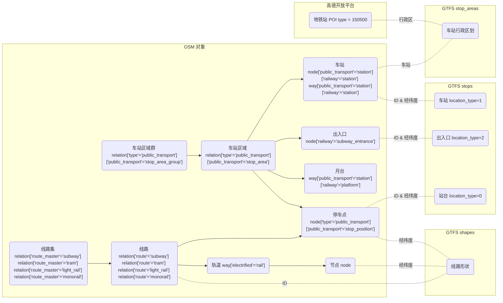

# beijing-subway-gtfs

General Transit Feed Specification (GTFS) of Beijing subway.

GTFS格式的北京地铁数据库。

## 简介

[GTFS](https://gtfs.org/) 是一种用于定义和分享公共交通静态时刻表与地理信息的开放数据标准格式。本项目从互联网收集数据，并分析整理**北京市地铁**（即包含地铁、有轨电车和磁悬浮列车，不包含国铁、市郊铁路的轨道交通）的线路、站点~~、车次、时刻表、计费~~等信息。

***正在制作中，敬请期待。***

## 文件夹说明

+ `spiders/ruubypay` 从亿通行接口获取数据的爬虫。**不建议**您运行这些文件。
+ `spiders/osm` 从 Open Street Map (OSM) 获取数据的脚本。
+ `spiders/amap` 从高德开放平台获取数据的爬虫。
+ `data` 原始或中间数据。
+ `tools` 用于数据分析整理转换的脚本。
+ `gtfs` （未打包的）GTFS 格式数据。

## GTFS数据说明

记录数据集中各个文件中在 [GTFS 文档中](https://gtfs.org/documentation/schedule/reference/)未规定的或需要额外说明的项。

规定所有作为主键的 ID，仅使用可打印的 ACSII 字符，采用蛇形命名法，并允许短横线。

本项目大量采用了 Open Street Map 的数据（以及作者顺手修复了些错误）和少部分高德地图的数据。这里提供一个简明图标来体现 OSM 数据和本 GTFS 数据的关联。

### [areas.txt](gtfs/areas.txt)

人工编写。

+ `area_id` 参考 **GB/T 2260-2007 《中华人民共和国行政区划代码》**。
+ 特别地，*大兴机场站*位于河北省。

### [agency.txt](gtfs/agency.txt)

人工编写。

+ 所有联系电话均为服务热线而非公司联系方式，后者请见官网等。
+ *北京市地铁运营有限公司*共有四个分公司，但对乘客无感。

### [calendar.txt](gtfs/calendar.txt)

人工编写。

### [routes.txt](gtfs/routes.txt)

人工编写。

+ 已贯通运营的线路合并处理，如*1号线（八通线）*、*4号线（大兴线）*、*10号线（一期和二期）*等。
+ `route_id`，**线路号**，由本项目定义，固定2位。
+ `route_type` 不取决于地上或地下，而是取决于其运行模式是轻轨或重轨。例如*燕房线*、*S1线*、*13号线*（几乎）全程在地上，但仍取`1`。
+ `route_color`，**线路色号**来自[官网地图](https://map.bjsubway.com/)。**DB11 T 657.2-2024 《公共交通客运标志 第2部分:城市轨道交通》**的 附录 B 表B.1 提供了`标志色示例`、`Pantone`和`CMYK`，并未提供`RGB`。不幸的是以上四者完全无法对应（或者笔者并未找到合适的转换算法）。

### [stops.txt](gtfs/stops.txt)

由`spiders/ruubypay/spider.py`和`spiders/osm/export.py`爬取，`tools/compute_stops.py`生成。

+ 对于 `location_type=1`，即车站，是区分线路的**逻辑车站**，即对于换乘站，不同线路享有不同的编号，并在[transfers.txt](#transferstxt)中明确换乘关系。 `stop_id` 为 OSM 中标签包含 `{"public_transport": "stop_area", "type": "public_transport"}` 的关系的ID； `stop_lat` 和 `stop_lon` 来自该关系的成员中标签包含 `{"railway": "station"}` 的节点。此举的考虑是后者可能多线路共用、而前者是对线路唯一。
+ 对于 `location_type=0` ，即站台，是列车的**停车点**。 `stop_id` 为 OSM 中标签包含 `{"public_transport": "stop_area", "type": "public_transport"}` 的关系的ID。其中换乘站不同线路对应不同的`stop_id`。特别的，*6号线海淀五路居站*（未使用）、*5号线宋家庄站*、*13号线西直门站*为西班牙式月台，本数据集仅包含停车孤岛而不包含上下车站台信息，参考[西班牙式月台](https://zh.wikipedia.org/wiki/%E8%A5%BF%E7%8F%AD%E7%89%99%E5%BC%8F%E6%9C%88%E5%8F%B0#%E5%8C%97%E4%BA%AC%E5%9C%B0%E9%93%81)。
+ 对于 `location_type=2` ，即**出口**。其 `stop_id` 为 OSM 中标签包含 `{"railway": "subway_entrance"}` 的节点的ID。
+ `stop_code` 是6位10进制的真实使用的**车站内部编号**，遵循 **BJJT/0049-2020 《城市轨道交通视频监视系统应用实施指南》**第14.4节。其中前2位为线路编号，区别于[routes](#routestxt)的`route_id`，第3为固定为`0`，第4至6位为车站代码，可参考[这篇文章](https://zhuanlan.zhihu.com/p/1898395707053966382)。

### ~~[trips.txt](gtfs/trips.txt)~~

+ `direction_id`，**方向标识**。**GB 50157-2013 《地铁设计规范》**中第3.3.1节规定，右侧行车，南北线路由南向北为上行；东西线路由西向东为上行；环形线路外侧（逆时针）为上行。定义上行为 `0`，下行为 `1`
+ `trip_id`，虚拟车次，由本项目定义。规则为第1-2位为 `route_id`，第3位为**服务日标志位**，第4位为`direction_id`，第5位为**行程标志位**，第6-7位为**行程编号**。其中**服务日标志位**和 `service_id` 对应，对于一般线路为 `wd => 0, we => 1`，对于*首都机场线*为 `mon_thu+sat_sun => 0, fri => 1`，对于*大兴机场线*为 `mon_thu+sat => 0, fri => 1, sun => 2`；**行程标志位**对于全程车（含完整环线）取 `0`、区间车（含不完整环线）取 `1`、大站快车取 `2`、需待避慢车取 `3`、跨线车取 `4`、支线车（暂无）取 `5`；当前项完全一致时，**行程标编号**由 `01` 起按照发车时间先后递增。
+ 对于环线列车和跨线列车，同一列车将对应多个 `trip_id`，共用同一 `block_id`。对环线某车次，除**循环站**外不包含重复车站。**循环站**指环线的虚拟终点站，可能会进行司机更换、停站时间略长（播放临时停车广播），但不会清客，*2号线*为*西直门*，*10号线*为*首经贸*。
+ `trip_headsign`，列车头显，由本项目定义。对于全程车为`始发站-终点站`。对于区间车为`始发站-终点站(区间车)`。对于大站快车为`始发站-终点站(大站快车)`或`始发站-终点站(xx专列)`。对于需待避慢车为`始发站-终点站(慢车)`。对于某线跨线车为`始发站-终点站(跨线车)`，在`跨线站`即*郭公庄*变更 `trip_id`。对于环线车为`始发站-终点站(x环 余n圈)`，在`循环站`变更 `trip_id`。其中`始发站`和`终点站`可能为**循环站**；`余n圈`指剩余的**循环站**至**循环站**的完整环线的数量，不含当前圈；当车次在终点站后回库时，将`余0圈`替换为`回库`。
+ 特别地，*首都机场线*按照单程线路处理，即只存在 `direction_id=0`，其 `trip_headsign` 固定为`北新桥-3号航站楼-2号航站楼-北新桥`。

### ~~[transfers.txt](gtfs/transfers.txt)~~

## 附录

### 名词解释与译名规范

+ 键或值使用`行内代码`，具体例使用*斜体*，关键表达和标准规范使用**粗体**。
+ OSM 相关术语：node-节点 relation-关系 way-路径 area-区域 member-成员 ref-引用 platform-站台 stop_area-停车区 stop_position-停车点。
